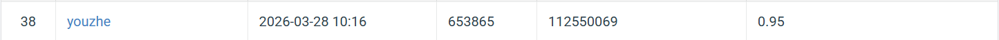

# NYCU VRDL 2026 HW1 - Image Classification with ResNet

* Student ID: 112550069
* Name: You Zhe, Xie

100-class image classification using a fully fine-tuned ResNet152 backbone. Built for the Visual Recognition HW1 competition.

## Introduction

This project tackles a 100-category image classification task. The approach uses **transfer learning** with a ResNet152 model pretrained on ImageNet-1K V2:

- The ResNet152 backbone is **fully fine-tuned** with a lower learning rate to preserve pretrained features while adapting to the new task.
- **GeM Pooling** (Generalized Mean Pooling, learnable p) replaces the standard Average Pooling to focus on discriminative local features.
- A lightweight classification head (`Dropout(0.3) → Linear(2048, 100)`) is appended on top.
- **CutMix** augmentation and **label smoothing** are applied for regularization.
- Total parameters: ~58.3M (under the 100M limit).

## Environment Setup

**Python** >= 3.9

Install dependencies:

```bash
pip install torch torchvision Pillow tqdm pyyaml
```

Or with a specific CUDA version (e.g. CUDA 11.8):

```bash
pip install torch torchvision --index-url https://download.pytorch.org/whl/cu118
```

## Dataset Structure

Place the dataset under the `data/` directory:

```
data/
├── train/
│   ├── 0/          # class 0 images
│   ├── 1/          # class 1 images
│   └── ...         # up to class 99
├── val/
│   ├── 0/
│   ├── 1/
│   └── ...
└── test/
    ├── xxxx.jpg    # unlabeled test images
    └── ...
```

- **Train**: 20,724 images across 100 classes
- **Val**: 300 images across 100 classes
- **Test**: 2,344 unlabeled images

## Usage

### Training

```bash
python train.py --config configs/default.yaml
```

All hyperparameters are defined in `configs/default.yaml`. CLI arguments override the config file if provided:

| Argument                  | Default (config)  | Description                          |
|---------------------------|-------------------|--------------------------------------|
| `--config`                | `configs/default.yaml` | Path to YAML config file        |
| `--data_dir`              | `data`            | Path to dataset root                 |
| `--save_dir`              | `checkpoints`     | Directory to save model checkpoints  |
| `--log_dir`               | `log`             | Directory to save training logs      |
| `--epochs`                | `60`              | Number of training epochs            |
| `--batch_size`            | `32`              | Batch size                           |
| `--lr`                    | `5e-4`            | Learning rate for classification head|
| `--backbone_lr`           | `5e-5`            | Learning rate for backbone           |
| `--weight_decay`          | `1e-4`            | Weight decay for classification head |
| `--backbone_weight_decay` | `1e-3`            | Weight decay for backbone            |
| `--dropout`               | `0.3`             | Dropout rate in classification head  |
| `--img_size`              | `448`             | Input image resolution               |

The best checkpoint (by validation accuracy) is saved to `checkpoints/best_model_<timestamp>.pth`.

### Evaluation

Evaluate on the validation set and generate test predictions:

```bash
python evaluate.py --checkpoint checkpoints/best_model_20260327_182517.pth --mode both --output prediction.csv
```

| Argument       | Default                      | Description                          |
|----------------|------------------------------|--------------------------------------|
| `--checkpoint` | `checkpoints/best_model.pth` | Path to saved model checkpoint       |
| `--data_dir`   | `data`                       | Path to dataset root                 |
| `--mode`       | `both`                       | `val`, `test`, or `both`             |
| `--output`     | `prediction.csv`             | Output CSV path for test predictions |

## Model Architecture

```
ResNet152 (fully fine-tuned, pretrained on ImageNet-1K V2)
    └── GeM Pooling (p=3.0, learnable)
         └── Classification Head:
              ├── Dropout(0.3)
              └── Linear(2048, 100)
```

## Training Details

| Setting            | Value                                        |
|--------------------|----------------------------------------------|
| Optimizer          | AdamW (differential LR for backbone vs head) |
| LR (head)          | 5e-4                                         |
| LR (backbone)      | 5e-5                                         |
| Weight decay (head)| 1e-4                                         |
| Weight decay (backbone) | 1e-3                                    |
| Scheduler          | CosineAnnealingLR (T_max=60, eta_min=1e-6)   |
| Loss               | CrossEntropyLoss + Label Smoothing (0.15)    |
| CutMix             | alpha=1.0, applied with 50% probability      |
| Augmentation       | RandomResizedCrop(448), HFlip, TrivialAugmentWide, RandomErasing |
| Batch size         | 32                                           |
| Input resolution   | 448×448                                      |
| Mixed precision    | AMP (GradScaler)                             |

## Performance Snapshot

| Metric              | Value              |
|---------------------|--------------------|
| Validation Accuracy | 93.33% (280 / 300) |
| Best Epoch          | 23                 |
| Total Parameters    | ~58.3M             |

Leaderboard Screenshot:



## File Structure

```
cv-recognition/
├── train.py            # Training loop with CutMix, AMP, cosine annealing
├── evaluate.py         # Validation evaluation and test prediction generation
├── model.py            # ResNet152 + GeM Pooling + classification head
├── dataset.py          # Dataset classes and augmentation transforms
├── plot_results.py     # Visualization of experiment results
├── configs/
│   └── default.yaml    # Hyperparameter configuration
├── results.tsv         # Experiment tracking log
├── results_progress.png# Accuracy improvement across experiments
├── prediction.csv      # Final test set predictions
├── README.md
├── checkpoints/        # Saved model checkpoints (not included in repo)
├── log/                # Training logs in JSON format (not included in repo)
└── data/               # Dataset (not included in repo)
```
