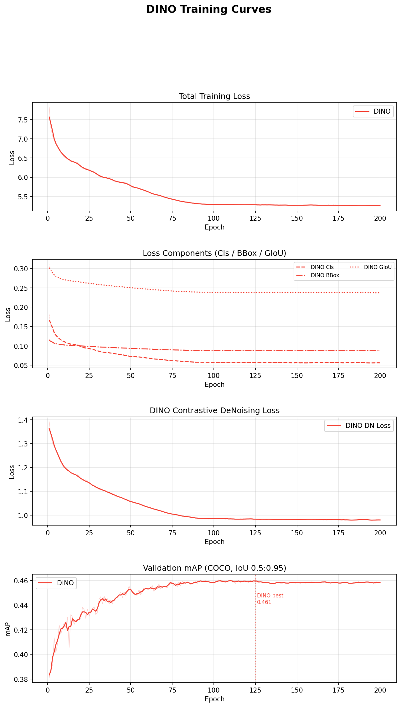

# Digit Detection with DINO

* Student ID: 112550069
* Name: You Zhe, Xie

10-class digit detection on street-view images using a pure-PyTorch DINO (DETR with Improved DeNoising Anchor Boxes) implementation. Built for the Visual Recognition HW2 competition.

See [report](report_en.pdf) for the detailed method, result and ablation study.

## Introduction

This project tackles multi-digit detection in street-view images. The approach adapts [DINO](https://arxiv.org/abs/2203.03605) with several key design choices:

- A **ResNet-50 backbone** extracts multi-scale features at strides 16, 32, and 64 (C4–C6).
- **Deformable multi-scale attention** (`F.grid_sample`-based MSDeformAttn) replaces standard attention — no custom CUDA ops required.
- **Mixed query selection** seeds positional anchors from encoder top-K features while keeping content queries learnable.
- **Contrastive DeNoising (CDN)** injects noised ground-truth queries during training for faster, more stable convergence.
- **Sigmoid focal loss** handles class imbalance without an explicit no-object class.
- Input images are upscaled to `min_side=600` so that stride-32 feature maps remain meaningful (≥15×15 tokens) for the tiny street-view digits in this dataset.

**Best validation mAP@0.5:0.95: 0.4611**

## Environment Setup

**Python** >= 3.9

Install dependencies:

```bash
pip install torch torchvision scipy
```

## Dataset Structure

Place the dataset under the `nycu-hw2-data/` directory:

```
nycu-hw2-data/
├── train/           # training images
├── test/            # test images
└── train.json       # COCO-format annotations
```

## Usage

### Training

```bash
python train_DINO.py --config configs/default_DINO.yaml
```

All hyperparameters are defined in `configs/default_DINO.yaml`. CLI arguments override the config file if provided:

| Argument         | Default | Description                                |
|------------------|---------|--------------------------------------------|
| `--config`       | —       | Path to YAML config file                   |
| `--batch_size`   | `8`     | Batch size (reduce if OOM)                 |
| `--epochs`       | `100`   | Number of training epochs                  |
| `--device`       | `cuda`  | Training device                            |
| `--resume`       | —       | Resume from checkpoint (restores all state)|
| `--load_weight`  | —       | Load weights only (epoch resets to 1)      |

Resume from a checkpoint:

```bash
python train_DINO.py --config configs/default_DINO.yaml \
    --resume checkpoints_DINO/best_model_DINO_<timestamp>.pth \
    --epochs 200
```

### Inference

```bash
python inference_DINO.py --config configs/default_DINO.yaml \
    --checkpoint checkpoints_DINO/best_model_DINO_<timestamp>.pth \
    --score_threshold 0.01
```

Outputs `predictions/pred.json` (COCO format) and `predictions/submission.zip`.

Run on the validation set:

```bash
python inference_DINO.py --config configs/default_DINO.yaml \
    --checkpoint checkpoints_DINO/best_model_DINO_<timestamp>.pth \
    --run_val --score_threshold 0.3
```

#### Test-Time Augmentation (TTA)

```bash
# Color-jitter TTA (original + 2 ColorJitter variants, fused with WBF)
python inference_DINO.py --config configs/default_DINO.yaml \
    --checkpoint checkpoints_DINO/best_model_DINO_<timestamp>.pth \
    --score_threshold 0.01 --tta

# Multi-scale TTA (2/3, 1, 4/3 of configured resolution)
python inference_DINO.py --config configs/default_DINO.yaml \
    --checkpoint checkpoints_DINO/best_model_DINO_<timestamp>.pth \
    --score_threshold 0.01 --tta --tta_mode scale
```

### Ensemble

```bash
cd predictions/

# WBF
python wbf_ensemble.py pred_a.json pred_b.json -o fused.json

# NMS
python nms_ensemble.py pred_a.json pred_b.json -o nms_fused.json
```

## Model Architecture

```
ResNet-50 (pretrained, fully fine-tuned)
    └── Multi-Scale Feature Pyramid: C4 (stride 16), C5 (stride 32), C6 (stride 64)
         └── Input Projection (Conv1×1 + GroupNorm) → [B, 256, Hi, Wi] × 3 levels
              └── Deformable Transformer Encoder (3 layers, MSDeformAttn)
                   └── Two-Stage Query Selection (top-K by objectness)
                        └── Mixed Query Selection
                        │    ├── Positional queries: encoder top-K anchor boxes
                        │    └── Content queries: learnable embeddings
                        └── Deformable Transformer Decoder (3 layers)
                             ├── Self-attention (standard multi-head, DN mask)
                             ├── Cross-attention (deformable, multi-scale)
                             └── Iterative box refinement (Look Forward Twice)
                                  └── Output: pred_logits [B, N, 10], pred_boxes [B, N, 4]
```

## Training Details

| Setting              | Value                                                    |
|----------------------|----------------------------------------------------------|
| Optimizer            | AdamW (differential LR for backbone vs transformer)      |
| LR (transformer)     | 1e-4                                                     |
| LR (backbone)        | 1e-5                                                     |
| Scheduler            | Multi-stage CosineAnnealingLR                            |
| Loss                 | Sigmoid Focal Loss (class) + L1 + GIoU (bbox)           |
| Augmentation         | RandomCrop, Expand, Translation, Blur, IsoNoise          |
| Batch size           | 8                                                        |
| Input resolution     | min_side=600, max_side=900                               |
| DN groups            | 10                                                       |
| Number of queries    | 10                                                       |
| Feature levels       | 3 (C4–C6)                                                |
| Mixed precision      | AMP (GradScaler)                                         |

## Performance Snapshot

| Experiment                          | val mAP@0.5:0.95 |
|-------------------------------------|-----------------|
| Baseline (from scratch)             | 0.4241          |
| + Higher resolution                 | 0.4386          |
| + Full spatial/pixel augmentation   | **0.4611**      |

Training curves:



## File Structure

```
HW2/
├── model_DINO.py           # DINO model (backbone, encoder, decoder, heads)
├── train_DINO.py           # Training script (focal loss, CDN, Hungarian matching)
├── inference_DINO.py       # Inference + TTA + submission export
├── dataset.py              # Dataset, collate_fn, augmentation pipeline
├── plot_training_curves.py # Plot loss/mAP from log JSON files
├── configs/
│   └── default_DINO.yaml   # All hyperparameters
├── predictions/
│   ├── wbf_ensemble.py     # Weighted Boxes Fusion ensemble
│   └── nms_ensemble.py     # NMS / Soft-NMS ensemble
├── log_DINO/
│   └── merge_logs.py       # Merge multi-stage training logs for plotting
├── README.md               # Intorduction to this project
├── report.pdf              # Detailed method, result, ablation study
└── (114-2) HW2 Slides.pdf  # Project spec
```
