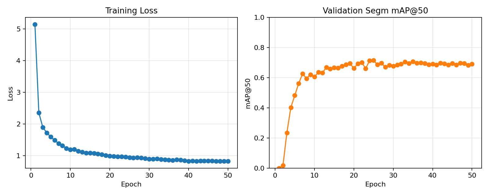
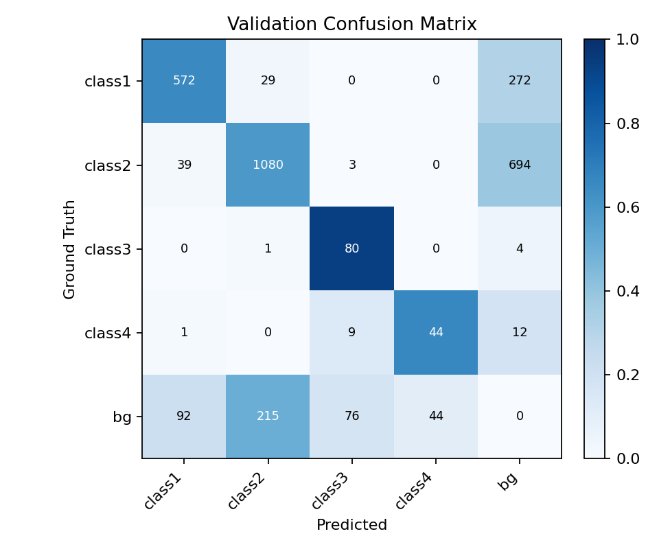

# Medical Cell Image Instance Segmentation: Cascade Mask R-CNN + ConvNeXt-V2-Base

Visual Recognition HW3

You-Zhe Xie

github: https://github.com/youzhe0305/NYCU-VRDL/tree/main/HW3

---

## 1. Introduction

The task of this assignment is **Instance Segmentation**: given color medical cell images, the model must produce precise segmentation masks for every cell instance and classify each into one of 4 cell types (class1–class4). The dataset contains 209 training images and 101 test images, evaluated using **AP50 (Average Precision @ IoU = 0.5)**.

For model design, I chose **Cascade Mask R-CNN** [1] as the core detection framework, paired with **ConvNeXt-V2-Base** [2] as the backbone, and integrated multi-scale features through **Feature Pyramid Network (FPN)** [3] (essentially sharing the same core philosophy as the MI-DETR and DINO approaches I experimented with in HW2). Compared to the standard Mask R-CNN [4], Cascade Mask R-CNN employs a three-stage progressive refinement strategy in the RoI Head, training bbox classifiers and regressors at each stage with increasing IoU thresholds, thereby significantly improving detection precision while maintaining high recall.

Additionally, the reason for choosing a CNN-based approach over a Transformer-based approach (which generally performs better overall) is that the training data for this assignment is very limited. Transformer methods require larger amounts of data, so CNN-based methods actually perform better in this scenario. (I actually tried Mask2Former + Swin backbone and the results were not satisfactory.)

---

## 2. Method

### 2.1 Data Preprocessing

#### Annotation Conversion

The original annotations are provided as per-class mask `.tif` files, where each unique pixel value represents one instance. The conversion pipeline is as follows:

1. Read all instance IDs
2. Generate a binary mask for each instance, filtering out noisy regions with area < 10
3. Output in standard COCO annotation format (including bbox, segmentation, area, etc.)

#### Data Split

A 90% / 10% train / validation split was used, with the number of classes present in each image as the stratify key. The seed was fixed at 42 to ensure uniform class distribution.

### 2.2 Training Data Augmentation

The data augmentation strategy for the training pipeline is designed as follows:

| Step | Operation | Setting | Purpose |
|------|-----------|---------|---------|
| 1 | RandomResize | scale=1024, ratio=(0.5, 2.0) | Multi-scale resizing to learn cells of different sizes |
| 2 | RandomCrop | 1024×1024 | Random cropping to increase positional diversity |
| 3 | RandomFlip (H) | prob=0.5 | Horizontal flip |
| 4 | RandomFlip (V) | prob=0.5 | Vertical flip (cells are isotropic) |
| 5 | Pad | 1024×1024, pad_val=114 | Unify batch dimensions |
| 6 | Color Jitter | all in 0.3 range | Enable model to learn cells with varying colors |
| 7 | Elastic Deformation | prob=0.1 | Cell motion deformation resembles elastic deformation, increasing diversity in cell shape variations |

### 2.3 Model Architecture

The overall architecture consists of five main components connected in series: First, the input image (1024×1024) passes through the **ConvNeXt-V2-Base Backbone** to extract 4 groups of multi-scale features (C0–C3, with channel counts of 128, 256, 512, and 1024 respectively); then, the **FPN Neck** projects these features to a unified 256 channels and produces a 5-level feature pyramid (P2–P6); next, the **RPN Head** generates approximately 1000 candidate boxes across all levels; these proposals enter the **Cascade RoI Head** for three-stage refinement (IoU ≥ 0.5 → 0.6 → 0.7) to progressively refine bbox and classification; finally, the **FCN Mask Head** produces a 28×28 per-instance binary mask for each detection result.

#### 2.3.1 ConvNeXt-V2-Base Backbone

The backbone uses **ConvNeXt-V2-Base** [2], loaded with ImageNet pre-trained weights. ConvNeXt-V2 is a pure CNN architecture with expressive power comparable to Transformers, while retaining the inductive bias advantages of CNNs, making it stable on small datasets.

#### 2.3.2 FPN Neck

Feature Pyramid Network [3] projects the backbone's multi-scale features to a unified 256 channels and fuses semantic and spatial information through a top-down pathway. It outputs 5 levels (P2–P6). FPN routes small objects through high-resolution P2/P3 and large objects through large-receptive-field P5/P6, which is particularly important for cell instances with significant size variations.

#### 2.3.3 Region Proposal Network (RPN)

The role of RPN [9] is to quickly filter out candidate regions (proposals) from the entire image that "likely contain objects" for further classification and refinement by the downstream RoI Head. Specifically, it places anchor boxes of predefined sizes at each spatial position on the feature maps of every FPN level, then uses a lightweight conv head to simultaneously predict the objectness score (foreground/background) and bbox offset for each anchor. During training, positive and negative samples are determined by IoU overlap with ground truth; during inference, NMS filters out highly overlapping proposals, ultimately retaining approximately 1000 high-quality candidate boxes. Key settings after experimental tuning:

| Parameter | Value | Description |
|-----------|-------|-------------|
| anchor_scale | **4** | Smaller anchor base size, better suited for cell scale |
| anchor_ratios | **[1.0]** | Square-only anchors, as cell shapes are approximately circular |
| pos_iou_thr | 0.7 | Positive if IoU with GT ≥ 0.7 |
| neg_iou_thr | 0.3 | Negative if IoU < 0.3 |
| nms_thresh | **0.45** | Proposal NMS threshold |
| proposals (test) | 1000 | Maximum proposals retained after NMS |

#### 2.3.4 Cascade RoI Head (3-stage Bbox)

The core of Cascade R-CNN [1] lies in training each stage with progressively stricter IoU thresholds, where the output boxes of the previous stage serve as input to the next stage, gradually refining localization and classification.

| Stage | IoU Threshold | Target Stds | Loss Weight |
|-------|:---:|---|:---:|
| 1 | 0.5 | (0.1, 0.1, 0.2, 0.2) | 1.0 |
| 2 | 0.6 | (0.05, 0.05, 0.1, 0.1) | 0.5 |
| 3 | 0.7 | (0.033, 0.033, 0.067, 0.067) | 0.25 |

#### 2.3.5 FCN Mask Head

On the proposals refined by Stage 3, features are extracted via RoIAlign, upsampled to 28×28, and finally a 1×1 conv produces the binary mask logit for each class, which is then resized back to the original bbox size.

### 2.4 Training Strategy

#### Optimizer

**AdamW** [7] was used with layer-wise learning rate settings:

| Parameter Group | Learning Rate | Weight Decay |
|-----------------|:---:|:---:|
| Backbone | 1e-5 | 0.05 |
| Neck / RPN / Head | 1e-4 | 0.05 |
| Norm layers & Bias | (same as above) | 0.0 |

The backbone uses a 0.1× LR multiplier to avoid disrupting ImageNet pre-trained features; not applying weight decay to norm layers and biases is a common practice in Transformer architectures.

#### Other Training Settings

| Setting | Value |
|---------|-------|
| Epochs | 100 |
| Batch size | 2 |
| Image scale | 1024×1024 |
| Stochastic Depth | 0.1 |
| AMP | Enabled |
| Seed | 42 |

---

## 3. Results

### 3.1 Best Model Performance

| Metric | Value |
|--------|-------|
| Best validation mAP@50 | **0.724** |
| GPU memory usage | ~13.6 GB |
| Trainable parameters | < 200M |

### 3.2 Training Curves

*Figure 1: Training loss (left) and validation segm mAP@50 (right) curves over epochs.*

The left plot shows that training loss drops rapidly from ~5.2 to ~2.3 during the first 2 epochs of linear warmup, then steadily decreases to ~0.83 by epoch 50. The right plot shows that validation mAP@50 surges between epochs 5–10 (from near 0 to ~0.63), then gradually converges to the 0.69–0.72 range under the cosine annealing schedule after epoch 20. The best mAP@50 = 0.724 was achieved around epoch 25.

### 3.3 Confusion Matrix

*Figure 2: Confusion matrix on the validation set (4 cell types + background). Numbers represent instance counts at IoU ≥ 0.5.*

The diagonal values show that the model correctly matches the majority of instances for all 4 classes: class1 (572/873, 65.5%), class2 (1080/1816, 59.5%), class3 (80/85, 94.1%), class4 (44/66, 66.7%). The dominant error type is missed detections (GT → bg column): class2 has the highest miss count (694), followed by class1 (272). Inter-class confusion is relatively low — the main misclassifications occur between class1 ↔ class2 (29 class1 predicted as class2, 39 class2 predicted as class1), because these two cell types share similar morphological features. The bg → predicted row shows 427 false positive predictions in total, with class2 accounting for the most (215). Class3 has the highest recall (94.1%), likely because its appearance is the most distinctive among all cell types.

### 3.4 Ground Truth vs. Prediction Comparison

*Figure 3: GT (left half) vs. Prediction (right half) comparison for 6 validation images. Different colors represent different cell classes.*

This contact sheet presents 6 representative validation images covering a variety of scenarios:

- **Top-left**: High-density scene with many small class1 cells (green). The model successfully detects and segments most instances, but a few tightly clustered cells are missed.
- **Top-right**: Sparse scene with mixed cell types (blue/purple). The model accurately segments well-separated cells with clean mask boundaries.
- **Middle-left**: Large class3 cells (pink/magenta) with distinctive morphological features. The model produces high-quality segmentation results, consistent with class3's highest recall (94.1%) in the confusion matrix.
- **Middle-right**: Extremely high-density scene dominated by class1 cells (orange). In severely overlapping regions, some instances are merged or missed — this is the model's primary failure mode.
- **Bottom-left**: Cells of mixed sizes (blue/green), demonstrating the model's multi-scale detection capability — both large and small cells are correctly segmented.
- **Bottom-right**: Large cells with clear boundaries (pink). The model's masks precisely match the ground truth contours.

### 3.5 Cumulative Improvement History

The following table records the step-by-step improvements from baseline to the final model:

| Stage | val segm_mAP_50 | Δ | Key Change |
|-------|:---:|:---:|------|
| Baseline | 0.658 | — | Cascade Mask R-CNN + ConvNeXt-V2-Base initial setup |
| + drop_path_rate=0.1 | 0.664 | +0.006 | Reduced Stochastic Depth, less random dropping during training |
| + anchor_scale=4 | 0.708 | +0.044 | Smaller anchor base size, better suited for cell-scale proposals |
| + square-only anchors | 0.713 | +0.005 | Square-only anchors (ratio=1.0), reducing memory and improving precision |
| + RPN NMS=0.5 | 0.723 | +0.010 | Lowered RPN proposal NMS threshold, retaining more high-quality proposals |
| + RPN NMS=0.45 | 0.724 | +0.001 | Further fine-tuned NMS threshold to optimal point |

*Table 1: Cumulative improvement history from baseline (0.658) to final model (0.724). The largest single gain came from adjusting the RPN anchor scale (+0.044).*

---

## 4. Additional Experiments

This section presents systematic ablation study results. Each experiment changes only a single factor, with all other settings identical to the best model. For each experiment, I provide: (a) hypothesis and motivation, (b) why it might or might not work, and (c) experimental results and analysis.

### 4.1 Stochastic Depth (Drop Path Rate)

**Hypothesis**: The default drop_path_rate=0.4 for ConvNeXt-V2-Base may be too aggressive for a small dataset (only 209 images). Excessive random dropping limits the number of blocks the model can utilize during each forward pass.

**Experimental Design**: All other settings are fixed; different drop_path_rate values are compared.

| drop_path_rate | val mAP50 | Δ | Status |
|:-:|:-:|:-:|---|
| 0.4 (default) | 0.658 | — | Baseline |
| 0.2 | 0.660 | +0.002 | Slight improvement |
| **0.1** | **0.664** | **+0.006** | **Best** |
| 0.05 | 0.656 | -0.002 | Below best |
| 0.0 (disabled) | 0.657 | -0.001 | Overfitting |

**Analysis**: drop_path_rate=0.1 achieved the best results. Excessively high drop path (0.4) limited model capacity; completely disabling it (0.0) led to overfitting, with mAP declining in later training stages. 0.1 strikes the optimal balance between regularization and model capacity.

### 4.2 RPN Anchor Scale

**Hypothesis**: The default anchor_scale=8 produces relatively large anchors (~32px on P2), which may not be precise enough for medium-to-small objects like cells. Smaller anchors can better match the actual size distribution of cells.

| anchor_scale | val mAP50 | Δ | Memory | Description |
|:-:|:-:|:-:|:-:|---|
| 8 (default) | 0.664 | — | 17.3 GB | Standard anchor size |
| **4** | **0.708** | **+0.044** | 17.6 GB | Smaller anchors, significant improvement |

**Analysis**: This was the **largest single improvement** across all experiments (+0.044). anchor_scale=4 makes the anchor sizes more closely match cell scales, enabling RPN to generate more precise initial proposals. This demonstrates that anchor design must match the target object's scale distribution—generic COCO settings may not be suitable for medical cell imagery.

### 4.3 Anchor Ratios

**Hypothesis**: Cell shapes are typically approximately circular. Among the three anchor ratios (0.5, 1.0, 2.0), the horizontal and vertical anchors may be redundant. Retaining only square anchors reduces IoU assignment computation while improving matching quality by concentrating anchors on the correct shape.

| anchor_ratios | val mAP50 | Δ | Memory |
|---|:-:|:-:|:-:|
| [0.5, 1.0, 2.0] (default) | 0.708 | — | 17.6 GB |
| **[1.0]** | **0.713** | **+0.005** | **13.3 GB** |
| [0.5, 1.0] | OOM | — | 18.2 GB |

**Analysis**: Using only square anchors not only improved mAP (+0.005) but also significantly reduced GPU memory usage (17.6 → 13.3 GB). Redundant anchor ratios increased the size of the IoU assignment matrix without providing better matching, instead introducing noise. The two-ratio configuration [0.5, 1.0] caused OOM due to an excessively large IoU assignment matrix, further demonstrating the importance of streamlined anchor design.

### 4.4 RPN Proposal NMS Threshold

**Hypothesis**: The RPN NMS threshold controls the overlap tolerance between proposals. A higher threshold retains more overlapping proposals (high recall) but increases the burden on downstream RoI Head; a lower threshold may prematurely remove valid proposals.

| NMS threshold | val mAP50 | Δ |
|:-:|:-:|:-:|
| 0.7 (default) | 0.713 | — |
| 0.6 | 0.713 | +0.000 |
| 0.5 | 0.723 | +0.010 |
| **0.45** | **0.724** | **+0.011** |
| 0.425 | 0.704 | -0.009 |
| 0.4 | 0.716 | +0.003 |

**Analysis**: NMS threshold=0.45 achieved the best results. Reducing from 0.7 to 0.45 yielded significant improvement (+0.011), indicating that the default RPN NMS was too lenient, retaining too many highly overlapping proposals that interfered with Cascade RoI Head learning. However, further reduction to 0.425 began to show recall degradation.

### 4.5 Backbone Comparison

**Hypothesis**: Different backbone architectures may exhibit varying performance in feature extraction for medical cell images.

| Backbone | val mAP50 | Δ | Memory |
|---|:-:|:-:|:-:|
| **ConvNeXt-V2-Base** | **0.724** | — | 13.6 GB |
| ConvNeXt-V2-Tiny | 0.564 | -0.160 | 7.7 GB |
| ConvNeXt-V2-Large (freeze=3) | 0.674 | -0.050 | 5.7 GB |
| ResNet-50 | 0.526 | -0.198 | 5.1 GB |
| Swin-Tiny | 0.585 | -0.139 | 6.4 GB |

**Analysis**: ConvNeXt-V2-Base significantly outperformed all other backbones. The substantial gap with ResNet-50 and Swin-Tiny demonstrates that the backbone's feature extraction capability is critical for final performance. ConvNeXt-V2-Large, due to parameter count constraints (> 200M), required freezing the first 3 stages, resulting in insufficient feature adaptability and suboptimal performance.

### 4.6 Neck Architecture Comparison

**Hypothesis**: More complex neck architectures (e.g., PAFPN, NASFPN) might improve performance through richer feature fusion.

| Neck | val mAP50 | Δ |
|---|:-:|:-:|
| **FPN** | **0.724** | — |
| PAFPN | 0.706 | -0.018 |
| NASFPN | 0.594 | -0.130 |
| FPN_CARAFE | 0.581 | -0.143 |
| HRFPN | 0.602 | -0.122 |
| ChannelMapper | 0.408 | -0.316 |
| FPN + GroupNorm | 0.646 | -0.078 |
| FPN + BatchNorm | 0.722 | -0.002 |
| FPN + DropBlock | 0.637 | -0.087 |

**Analysis**: The standard FPN turned out to be the best choice. None of the alternative necks surpassed the simple FPN. PAFPN was the closest (0.706), but the additional bottom-up path did not provide sufficient gains for this task. More complex architectures such as NASFPN and FPN_CARAFE actually suffered significant drops due to overfitting. This confirms that in small-dataset scenarios, increasing model complexity does not necessarily lead to performance improvement.

### 4.7 Loss Function Comparison

**Hypothesis**: Different loss functions may affect the model's learning efficiency for hard samples.

| Change | val mAP50 | Δ |
|---|:-:|:-:|
| **Baseline (CE + SmoothL1)** | **0.724** | — |
| RPN: FocalLoss | 0.702 | -0.022 |
| Bbox: GIoULoss | 0.678 | -0.046 |
| Bbox cls: FocalLoss | 0.592 | -0.132 |
| Bbox: BalancedL1Loss | 0.654 | -0.070 |

**Analysis**: In this task, the standard CrossEntropyLoss + SmoothL1Loss combination performed best. Focal Loss on RPN decreased performance by 2.2 percentage points (0.724 → 0.702), possibly because the foreground/background imbalance in cell images is less severe than in COCO, and Focal Loss's hard-example weighting actually interfered with learning. GIoU Loss and BalancedL1 Loss also failed to improve results.

### 4.8 Number of Cascade Stages

**Hypothesis**: Increasing or decreasing the number of cascade stages may affect the effectiveness of bbox refinement.

| Cascade Stages | IoU Thresholds | val mAP50 | Δ |
|---|---|:-:|:-:|
| 2 stages | [0.5, 0.6] | 0.719 | -0.005 |
| **3 stages** | **[0.5, 0.6, 0.7]** | **0.724** | — |
| 4 stages | [0.5, 0.6, 0.7, 0.75] | 0.714 | -0.010 |
| 3 stages (alt) | [0.5, 0.6, 0.65] | 0.720 | -0.004 |

**Analysis**: The standard 3-stage cascade (IoU 0.5/0.6/0.7) was the most effective. 2 stages provided insufficient refinement (-0.005), while 4 stages likely suffered from an overly strict IoU=0.75 at the final stage, leading to insufficient positive samples and reduced learning efficiency.

### 4.9 Detector Architecture Comparison: CNN-based vs. Transformer-based

**Hypothesis**: Transformer-based methods (e.g., Mask2Former [8]) outperform CNN-based methods on large-scale datasets such as COCO. However, this task has only 209 training images, and the Transformer's dependence on large amounts of data may become a disadvantage. CNN architectures possess natural locality and translation equivariance inductive biases, which should be more advantageous under data scarcity.

**Experimental Design**: Different detector architectures and backbone combinations are compared under the same training settings.

| Detector | Backbone | val mAP50 | Δ |
|---|---|:-:|:-:|
| **Cascade Mask R-CNN** | **ConvNeXt-V2-Base** | **0.724** | — |
| Cascade Mask R-CNN | ConvNeXt-V2-Tiny | 0.564 | -0.160 |
| Cascade Mask R-CNN | ResNet-50 | 0.526 | -0.198 |
| Cascade Mask R-CNN | Swin-Tiny | 0.585 | -0.139 |
| Mask R-CNN (StandardRoIHead) | ConvNeXt-V2-Base | 0.637 | -0.087 |

**Analysis**:

1. **Cascade vs. Standard Mask R-CNN**: The Cascade architecture brought a significant improvement of +0.087 (0.637 → 0.724), validating the effectiveness of the multi-stage refinement strategy for this task. Standard Mask R-CNN uses only a single IoU threshold and cannot progressively improve precision while maintaining recall like Cascade does.

2. **CNN vs. Transformer backbone**: Under the same Cascade Mask R-CNN framework, the CNN-based ConvNeXt-V2-Base (0.724) significantly outperformed the Transformer-based Swin-Tiny (0.585). Although Swin Transformer excels on large-scale datasets, in a small-dataset scenario with only 209 images, its self-attention mechanism lacks sufficient training signals to learn effective attention patterns, making it inferior to CNN architectures with stronger inductive biases. This aligns with the common understanding that "Transformers require large amounts of data to demonstrate their advantages."

3. **Backbone capacity**: ConvNeXt-V2-Base significantly outperformed the Tiny version (0.724 vs. 0.564), indicating that within the assignment's 200M parameter limit, a larger backbone can extract richer features. ResNet-50 performed the worst (0.526), further highlighting the advantages of modern backbone designs (e.g., GRN, depthwise conv) over traditional ResNet.

### 4.10 Other Component Ablations

| Experiment | val mAP50 | Δ | Description |
|---|:-:|:-:|---|
| Shared4Conv1FC BBoxHead | 0.694 | -0.030 | Conv-based RoI head underperforms FC-based |
| ConvFC BBoxHead | 0.705 | -0.019 | Conv+FC hybrid head underperforms pure FC |
| SCNet MaskHead | 0.619 | -0.105 | Alternative mask head shows significant drop |
| OHEM Sampler | 0.496 | -0.228 | Hard-example mining performs extremely poorly |
| Class-agnostic mask | 0.680 | -0.044 | Sharing mask head across all classes is ineffective |
| Remove backbone LayerNorm | 0.669 | -0.055 | Numerical instability leads to performance drop |

---

## 5. Hyperparameter Summary

### 5.1 Model Hyperparameters

| Hyperparameter | Value | Meaning |
|----------------|-------|---------|
| backbone | convnextv2_base | ConvNeXt-V2 Base as feature extractor |
| pretrained | True | ImageNet pre-trained weights |
| drop_path_rate | 0.1 | Stochastic Depth drop rate |
| fpn_out_channels | 256 | Output channels for each FPN level |
| num_classes | 4 | 4 cell types |
| cascade stages | 3 | IoU thresholds: 0.5/0.6/0.7 |
| anchor_scale | 4 | Small anchors suited for cell scale |
| anchor_ratios | [1.0] | Square-only anchors |
| rpn_nms_thresh | 0.45 | RPN proposal NMS threshold |

### 5.2 Training Hyperparameters

| Hyperparameter | Value |
|----------------|-------|
| Optimizer | AdamW |
| lr (head/neck) | 1e-4 |
| lr (backbone) | 1e-5 |
| Weight decay | 0.05 |
| Warmup epochs | 5 |
| Total epochs | 50 |
| Batch size | 2 |
| Image scale | 1024×1024 |
| Grad clip | max_norm=1.0 |
| AMP | Enabled |

### 5.3 Inference Hyperparameters

| Hyperparameter | Value |
|----------------|-------|
| score_threshold | 0.05 |
| nms_threshold | 0.5 |
| mask_threshold | 0.5 |
| max_det | 300 |

---

## 6. References

[1] Cai, Z., & Vasconcelos, N. (2018). Cascade R-CNN: Delving into High Quality Object Detection. In *Proceedings of the IEEE Conference on Computer Vision and Pattern Recognition (CVPR)*, pp. 6154–6162.

[2] Woo, S., Debnath, S., Hu, R., Chen, X., Liu, Z., Kweon, I. S., & Xie, S. (2023). ConvNeXt V2: Co-designing and Scaling ConvNets with Masked Autoencoders. In *Proceedings of the IEEE/CVF Conference on Computer Vision and Pattern Recognition (CVPR)*.

[3] Lin, T.-Y., Dollár, P., Girshick, R., He, K., Hariharan, B., & Belongie, S. (2017). Feature Pyramid Networks for Object Detection. In *Proceedings of the IEEE Conference on Computer Vision and Pattern Recognition (CVPR)*, pp. 2117–2125.

[4] He, K., Gkioxari, G., Dollár, P., & Girshick, R. (2017). Mask R-CNN. In *Proceedings of the IEEE International Conference on Computer Vision (ICCV)*, pp. 2961–2969.

[5] Chen, K., Wang, J., Pang, J., et al. (2019). MMDetection: Open MMLab Detection Toolbox and Benchmark. *arXiv preprint arXiv:1906.07155*.

[6] Liu, Z., Mao, H., Wu, C.-Y., Feichtenhofer, C., Darrell, T., & Xie, S. (2022). A ConvNet for the 2020s. In *Proceedings of the IEEE/CVF Conference on Computer Vision and Pattern Recognition (CVPR)*.

[7] Loshchilov, I., & Hutter, F. (2019). Decoupled Weight Decay Regularization. In *International Conference on Learning Representations (ICLR)*.

[8] Cheng, B., Misra, I., Schwing, A. G., Kirillov, A., & Girshick, R. (2022). Masked-attention Mask Transformer for Universal Image Segmentation. In *Proceedings of the IEEE/CVF Conference on Computer Vision and Pattern Recognition (CVPR)*, pp. 1290–1299.

[9] He, K., Zhang, X., Ren, S., & Sun, J. (2016). Deep Residual Learning for Image Recognition. In *Proceedings of the IEEE Conference on Computer Vision and Pattern Recognition (CVPR)*, pp. 770–778.

[10] Liu, Z., Lin, Y., Cao, Y., Hu, H., Wei, Y., Zhang, Z., Lin, S., & Guo, B. (2021). Swin Transformer: Hierarchical Vision Transformer using Shifted Windows. In *Proceedings of the IEEE/CVF International Conference on Computer Vision (ICCV)*.

[11] Ren, S., He, K., Girshick, R., & Sun, J. (2015). Faster R-CNN: Towards Real-Time Object Detection with Region Proposal Networks. In *Advances in Neural Information Processing Systems (NeurIPS)*, Vol. 28.

[12] Paszke, A., Gross, S., Massa, F., Lerer, A., Bradbury, J., Chanan, G., et al. (2019). PyTorch: An Imperative Style, High-Performance Deep Learning Library. In *Advances in Neural Information Processing Systems (NeurIPS)*, Vol. 32.

[13] Wightman, R. (2019). PyTorch Image Models (timm). GitHub repository: https://github.com/huggingface/pytorch-image-models.
